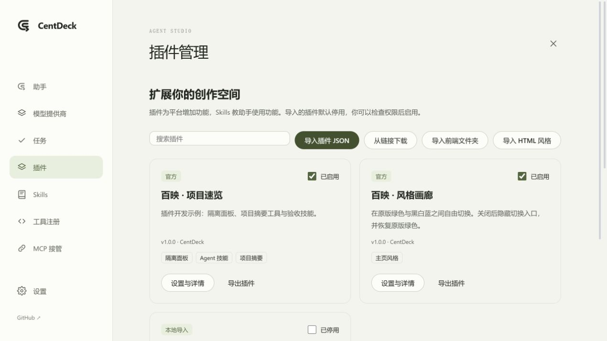
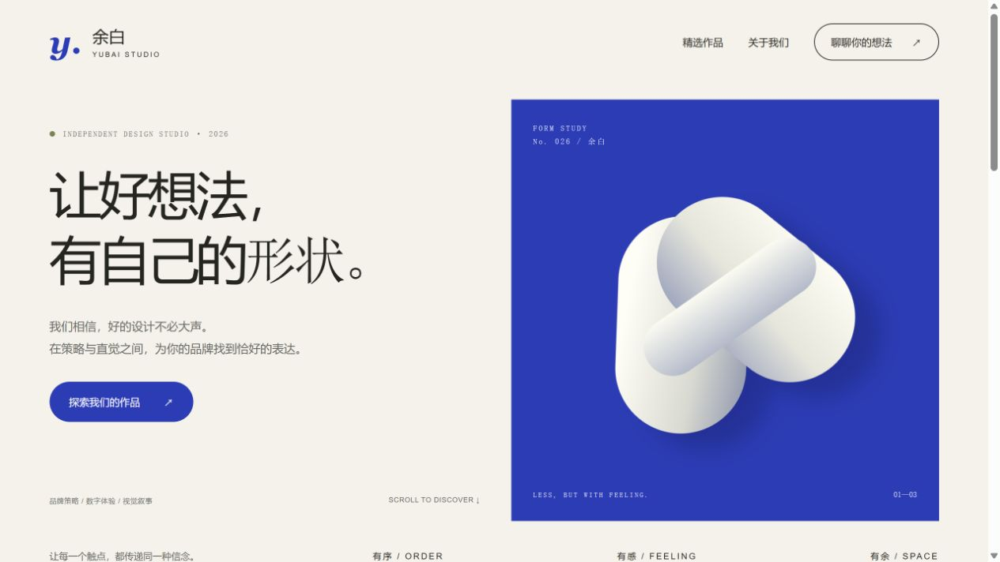

<div align="center">

# CentDeck · 百映

**AI 写前端，你在画布上指和改。**

**An AI frontend workbench. Build with agents, refine on a visual canvas.**

[中文](#中文) · [English](#english) · [插件开发](docs/插件开发规范.md) · [MCP & Skills](docs/MCP与Skills.md) · [贡献 / Contributing](CONTRIBUTING.md)

</div>



## 中文

CentDeck（百映）是面向 **AI 前端开发、vibe coding、可视化网页编辑**的本地工作台。把页面、弹窗、设计方案放在同一块画布上；用点选、框选、草图和引用精确告诉 AI 要改哪里。改字、对齐、调字号等小修改直接写回真实源码，不必每次调用模型。

**双击 `CentDeck.bat` → 浏览器打开 → 开始创作。** 保持原生 JavaScript、免构建、本地文件夹的交付方式；需要 Node.js 22+，没有 npm 安装步骤。内置 HTML 解析器随源码提供。

### 你可以做什么

- **创建真实前端**：自然语言创建项目、自定义 OpenAI 兼容 API、手动填写或发现模型，使用自己的提供商与密钥。
- **灵活的 Agent 工作台**：自定义助手、角色、职责、提示词、Skills、模型和六档思考强度；计划/创建模式、范围限制、每轮工具调用上限、反问、停止、继续和一层多 Agent 协作。
- **可视化精修**：页面总览、DOM 与源码映射、文字与属性修改、拖动、缩放、三灯判定、锁定、撤销和历史。动态生成或无法可靠定位的元素会说明限制。
- **草图指挥**：画笔、箭头、框选、便签、参考图、按颜色独立编号、@ 引用和可复制任务单。
- **电脑与手机**：分别预览和修改；真实页面放映、跳转与弹窗，手机修改可写入独立媒体查询。
- **Skills 与工具**：内置平台操作规范自动给 Agent 使用，其他技能按需加载；基础技能始终启用；查看、启停、导入和编辑自建 SKILL.md；按来源折叠的工具注册表。
- **MCP 接管**：标准 stdio 适配器和本机 JSON-RPC HTTP 端点；外部 AI 可读写项目、操作已登录页面、添加草图，或启动内置 Agent。面向 Codex、Claude Code、DeepSeek Harness 等支持 MCP 的客户端。
- **插件管理**：导入 JSON 包、前端文件夹、HTML 风格或 HTTPS 下载链接；查看权限、启停、设置、导出与卸载。官方“风格画廊”默认启用，关闭即恢复绿色并隐藏风格切换；“项目速览”作为内部工具保留，不再出现在用户插件列表。
- **带走你的项目**：源码、图片和项目说明都在普通文件夹里，可用 Git 管理；编辑器“更多 → 导出项目 ZIP”打包交付。

### 开始使用

1. 获取仓库源码；确保 `node --version` 为 22 或以上。
2. Windows 双击 `CentDeck.bat`。macOS / Linux 可运行 `bash start.sh`，或 `node server/server.js`。
3. 默认地址为 `http://localhost:8420`；占用时自动顺延。终端输入 `exit` / `q` 或按 Ctrl+C 退出。
4. 初始账号和密码均为 `centdeck`，首次登录必须修改密码。
5. 首页可描述需求、创建空白项目、使用模板或导入已有 HTML/文件夹。
6. 首页或编辑器顶部的“设置”可直接进入管理。先在“模型提供商”填写 API 地址、密钥和模型，再进入助手的创建模式。

模型格式可选 OpenAI Compatible（含 DeepSeek 与第三方中转站，`/v1` + `chat/completions`）或 Google Gemini 原生（`/v1beta` + `generateContent`）。图像、音频输入和工具调用按模型设置。创建任务需要工具调用；图片引用需要相应视觉能力。思考等级 `low / medium / high / xhigh / max / ultra` 在 OpenAI Compatible 中按原值作为 `reasoning_effort` 发送，上游必须支持所选参数；不支持时明确报错，不擅自降档。Gemini 原生格式按原生 thinking 参数处理；不支持的档位明确报错，不自动降档。费用由你的模型提供商计算。

首页可选择 Web 或 App（手机网页 / H5）、本次使用的模型，并添加图片、音频或文本参考附件。总览与编辑共享设计规范入口：总览预设库默认折叠，提供瑞士极简、现代 SaaS、编辑杂志、柔和自然、午夜科技和新粗野主义六种方向；编辑页只做单页精调。个人预设可跨项目复用；总览卡片支持拖动、删除、撤销与保存 AI 方案。便签按颜色独立编号，删除后复用空号，确认仅保存并收起。每轮工具上限累计一次回复中的所有工具调用，达到上限暂停；模型输出截断也会保留结果并允许继续。

### 插件、Skills、MCP 各管什么

| 层 | 服务对象 | 示例 |
|---|---|---|
| 插件 | 平台用户 | 主页风格、隔离面板、受管扩展工具 |
| Skills | 内置与外部 Agent | 施工规范、设计方案、草图修改、页面验收 |
| MCP | 外部 AI 客户端 | 读文件、提交修改、控制页面、调度内置助手 |

v1 插件支持设计变量、自定义主页、隔离面板、技能和受管项目摘要工具。自定义主页使用沙箱；同包 CSS/普通 JS 可内联，网络与任意宿主脚本不开放。框架适配器、任意第三方服务端工具和专业时间轴不属于当前已实现扩展点。HTTPS 下载受浏览器 CORS 限制，无法直接下载时可先下载 JSON 再本地导入。

### 一个实际案例

**余白 YUBAI**：用 MCP 读取版本并提交的三页品牌工作室网站，包含响应式布局、作品分类、咨询弹窗、本地表单摘要和案例跳转。完整源码位于 [examples/yubai](examples/yubai)，可直接导入百映。表单是本地演示，不发送真实咨询。



### 本地数据与边界

- `projects/<id>/`：项目源码、`project.json`、设计规范和 `.centdeck/` 历史/任务。
- `config.local/`：本地账号、提供商密钥、助手及插件设置；Git 忽略，不随项目 ZIP 导出。
- `app/skills/`：官方 Agent Skills；`plugins/`：官方插件示例。
- 当前只监听回环地址。它是单机工作台，不是公网多人服务。预览运行导入网页的代码，请只打开你信任的项目。
- MCP 的模式与写入保护约束受管接口；拥有直接文件系统权限的外部程序仍可绕过接口修改文件。
- 源码包 ZIP 不含隐藏历史目录；需要全部历史时保留整个项目文件夹。

### 验证状态

基础引擎、接口、Agent 调度、六档思考参数、停止与迟到结果、版本冲突、锁定、多文件提交和扩展/MCP 回归均有测试。已实际通过 MCP 控制浏览器、添加/撤销草图、调用内置 Agent 隔离测试提供商并核对任务结果。交付案例已检查桌面、393px 手机、筛选、弹窗、表单与跳转。

**真实模型验收取决于可用提供商。** 本次本机已有接口在模型发现时返回 401，因此不能将隔离测试提供商的成功当作真实模型联网生成成功；也未测试其它 AI 客户端。详细记录见 [收尾验收](docs/收尾验收.md) 和 [本次修复与截断对话核查](docs/界面修复与收尾核查_2026-10-01.md)。

```sh
node --experimental-vm-modules tests/frontend-syntax.test.mjs
node tests/agent-runtime.test.mjs
node tests/extensions.test.mjs
node tests/mcp-transport.test.mjs
node tests/api.test.mjs
node tests/engine.test.mjs
node tests/scan.test.mjs
node tests/token-source.test.mjs
node tests/workspace-state.test.mjs
node tests/note-numbers.test.mjs
node tests/providers.test.mjs
node tests/composer.test.mjs
node --experimental-vm-modules tests/workbench-interactions.test.mjs
node tests/external-agent.test.mjs
node tests/external-runtime.test.mjs
node tests/mcp-improvements.test.mjs
node tests/mcp-client.test.mjs
node tests/capture-page.test.mjs
node tests/frame-scheduling.test.mjs
```

## English

**CentDeck is a local AI frontend builder and visual website workbench.** Put pages, dialogs and design variants on one canvas. Point, select, sketch and reference exactly what your agent should change. Refine text, alignment and typography directly in the source without spending model tokens on every small edit.

Double-click `CentDeck.bat`, open the browser and start building. Node.js 22+ is required. Native JavaScript, no build step, no npm installation, ordinary project folders.

### Highlights

- **Bring your own API**: custom OpenAI-compatible endpoints, provider keys, model discovery or manual model IDs, optional vision and tool calling.
- **Agent studio**: customizable assistants, prompts, skills, models, six reasoning levels, plan/create modes, scoped edits, budgets, questions, cancellation, resumption and one-level multi-agent collaboration.
- **Visual editing**: overview canvas, source mapping, text/property editing, drag/resize, writeback confidence, locks, undo and history. Unsupported dynamic elements are reported rather than silently rewritten.
- **Sketch feedback**: drawings, arrows, boxes, notes, reference images, numbered marks and precise agent references.
- **MCP integration**: a standard stdio bridge and local JSON-RPC HTTP endpoint. External agents can inspect/edit projects, operate the signed-in browser and invoke built-in agents. Intended for MCP-capable clients including Codex, Claude Code and DeepSeek Harness.
- **Plugin framework**: import bundles or frontend files, download via HTTPS, inspect permissions, enable/disable and export. Official Style Gallery controls the home style picker; disabling it restores original green. Project Inspector remains an internal tool, hidden from user plugin management. Built-in skills are always available and hidden from manual selectors.
- **Portable output**: real HTML/CSS/JS, desktop/mobile previews, a presentation view and project ZIP export.

### Quick start

1. Download or clone this repository and have Node.js 22+ available.
2. Run `CentDeck.bat`, `bash start.sh`, or `node server/server.js`.
3. Sign in with `centdeck / centdeck` and change the initial password.
4. Open Settings directly from the home/editor toolbar. Configure a provider and model before using an agent.
5. Create a project, import a frontend folder or start from a template. Choose **Create** when you want the agent to write files.

Choose Web or mobile H5 on the home screen. The overview has shared design settings, six built-in presets and reusable personal presets. Notes use independent color numbering and reusable gaps. Tool limits count all calls in a reply, pause safely and allow continuation. Truncated model output is preserved as a paused task. Native Gemini and OpenAI-compatible formats support per-model input/tool capabilities.

The default address is `http://localhost:8420`. Exit with `exit`, `q` or Ctrl+C in the terminal. Reasoning levels are transmitted unchanged as `reasoning_effort`; unsupported provider values produce an error. API costs are paid to your provider.

### Scope and verification

Plugin API v1 supports design tokens, isolated custom homes/panels, skills and managed project-summary tools. It does not run arbitrary server-side plugin code. Bundled CSS and classic JavaScript can be inlined; remote assets and module-based frontend builds are outside the custom-home contract.

Tests cover runtime guards, six reasoning values, conflict handling and extension/MCP behavior. A real MCP client operated the browser, added and undid marks, and invoked the built-in scheduler against an isolated test provider. The YUBAI frontend was written through MCP and checked on desktop/mobile with real interactions. The locally configured real provider returned HTTP 401, so real-provider generation remains unverified. Other AI clients were not tested.

Project files stay in `projects/`. Secrets and local configuration stay in Git-ignored `config.local/`. The app listens on loopback and is intended for local use. Project previews execute the imported project's code; open trusted projects. Direct filesystem access is outside MCP's permission boundary.

## 文档 / Documentation

| 文档 | 内容 / Contents |
|---|---|
| [项目说明](docs/项目说明书.md) | Product vision and original design |
| [技术架构与计划](docs/技术架构与三步计划.md) | Original architecture and roadmap |
| [收尾验收](docs/收尾验收.md) | Plan comparison, evidence and remaining limitations |
| [插件开发规范](docs/插件开发规范.md) | Bilingual plugin contract and working examples |
| [MCP 与 Skills](docs/MCP与Skills.md) | Bilingual connection guide and agent workflow |
| [CONTRIBUTING](CONTRIBUTING.md) | Contributions, tests, issues and PRs |

## 许可与贡献 / License and contributions

源码使用 [CentDeck Source License 1.0](LICENSE)：允许使用、修改、商业使用与保留来源的协作 Fork；要求保留署名和许可，禁止冒充原创、去除来源并把整体项目换牌再分发。用户用百映创建的独立网页不因此受此许可约束。第三方组件保留自己的许可，见 [THIRD_PARTY_NOTICES](THIRD_PARTY_NOTICES.md)。

Source is available under the **CentDeck Source License 1.0**, allowing use, modification, commercial use and attributed collaborative forks, while prohibiting false authorship and rebranding the substantially complete project as another product. Independently created user websites are not covered by this license merely because they were made with CentDeck. Third-party components retain their own licenses.

该协议含额外限制，**不是 MIT，也不属于 OSI 认可的标准开源许可**。/ This restricted source-available license is **not MIT or an OSI-approved open-source license**.

**欢迎 PR 和 Issues。** 报 Bug、分享前端案例、改进文档、贡献技能或插件，都欢迎。

**PRs and issues are welcome** — bug reports, frontend examples, documentation, skills and plugins.

关键词 / Keywords: **AI frontend builder · vibe coding · visual website editor · local-first · BYOK · custom API · MCP · Agent Skills · multi-agent · plugin framework · HTML CSS JavaScript · 前端工作台 · 可视化编辑 · 自定义 API · AI 网页生成**
