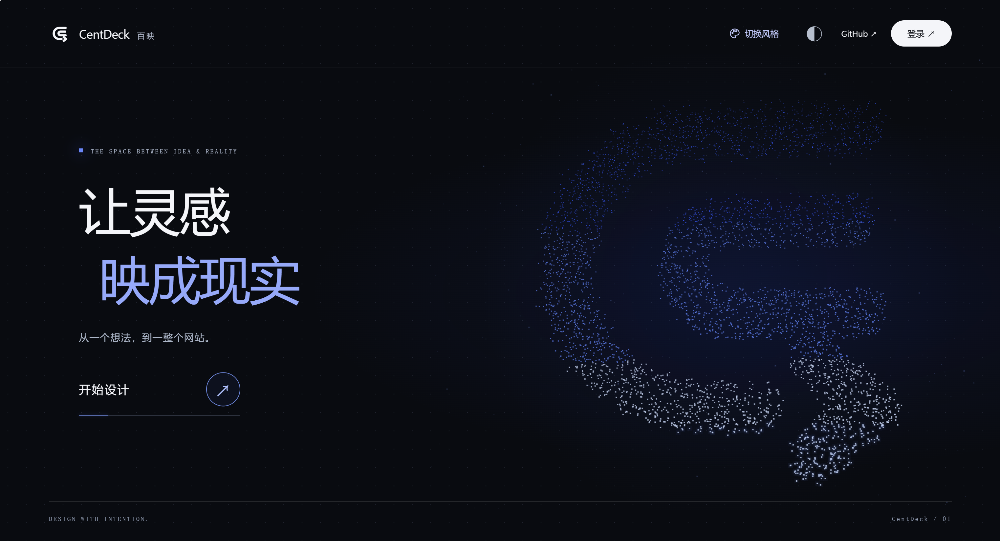
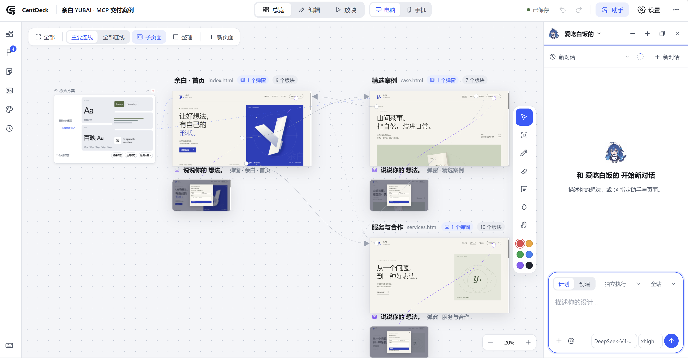
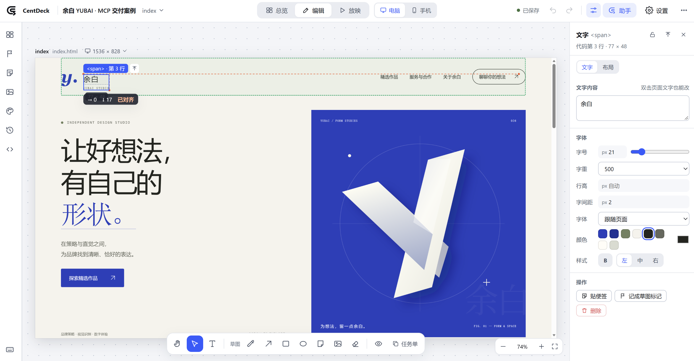
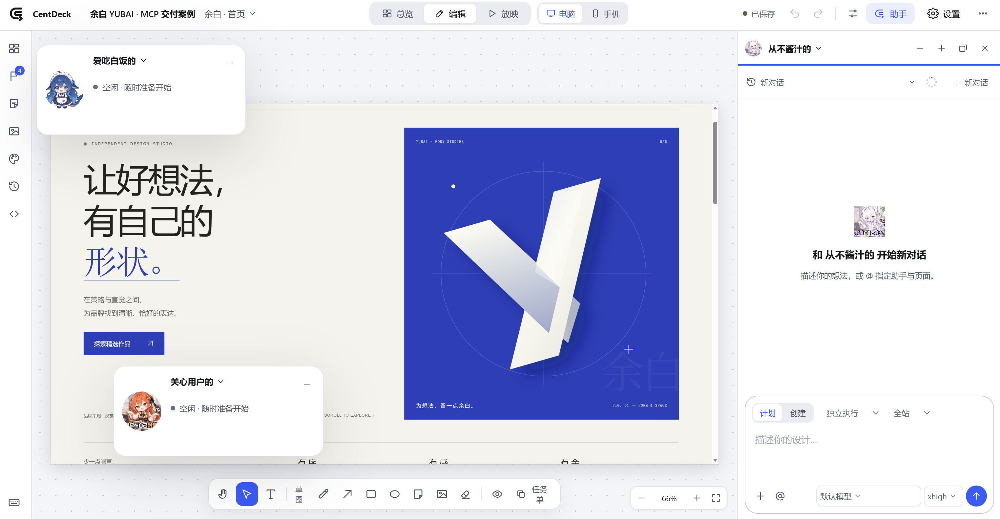

<picture><source media="(prefers-color-scheme: dark)" srcset="docs/assets/centdeck-dark.svg"></picture>

[简体中文](README.md) · [繁體中文](README.zh-TW.md) · [English](README.en.md)

**讓 Agent 搭建前端，讓你像做 PPT 一樣完成設計。**

內建模型 API 連線 · 無限畫布 · 視覺化精修 · 手動編輯零模型 Token

CentDeck（百映）是一款面向 AI 使用者的本機前端工作台。連接自己的模型 API，讓 Agent 產生頁面；在無限畫布上比較風格與頁面關係，再用拖曳、改字和屬性面板完成細節調整。

**移動標題、調整字級、修改文案，不必再送出一次提示詞。** 可直接編輯的元素會寫回真正的 HTML/CSS，手動操作不呼叫模型，也不消耗模型額度。

## 從想法到成品，留在同一個工作台

| 能力 | 你可以做什麼 |
|---|---|
| **內建 Agent 與 API 連線** | 連接 OpenAI Compatible、Gemini 或本機相容服務，管理模型、助手、Skills 與獨立對話。 |
| **無限畫布** | 同時查看頁面、彈出視窗與設計規範，縮放、平移、拖曳排列，快速確定整體方向。 |
| **像 PPT 一樣精修** | 直接改字、拖曳元素，調整大小、字級、顏色和間距；支援對齊、鎖定、復原與版本歷史。 |
| **手動編輯零模型 Token** | 將簡單調整交給滑鼠與鍵盤，把 AI 額度留給產生內容、結構調整與複雜工作。 |
| **便箋與精確引用** | 使用彩色便箋、草圖、參考圖和 @ 引用，清楚標示要交給 Agent 修改的位置。 |
| **MCP 與多助手** | 連接支援 MCP 的外部 AI 應用程式，以停駐或浮動視窗組織多位助手。 |
| **真正的原始碼交付** | 匯入既有 HTML，預覽桌面與手機效果，匯出包含原始碼和素材的專案 ZIP。 |

## 先定方向，再打磨細節

### 在無限畫布上看全局

把頁面、彈出視窗與設計規範放在一起。比較預設或 Agent 產生的方案，選定方向後再進入單頁編輯。

### 用滑鼠完成最後一毫米

點選、拖曳、雙擊改字，像整理一頁 PPT。對能對應到原始碼的元素直接寫回；需要結構性修改時，加入標記交給 Agent。

### 讓助手各司其職

建立適合不同工作的助手，依專案管理對話。視窗可停駐、浮動或折疊；支援編輯重送、停止、重試及上下文壓縮。

## 快速開始

需要 **Node.js 22 或更新版本**，無需 npm 安裝或建置。

~~~bash
git clone https://github.com/zzz27578/CentDeck.git
cd CentDeck
~~~

- **Windows**：雙擊 `CentDeck.bat`。
- **macOS / Linux**：執行 `bash start.sh`。
- 也可直接執行 `node server/server.js`。

瀏覽器預設開啟 `http://localhost:8420`。首次使用以 `centdeck / centdeck` 登入，並設定自己的密碼。

1. 在 **設定 → 模型提供商** 中加入 API 位址、金鑰與模型。
2. 建立空白專案、使用範本，或匯入既有網頁。
3. 讓 Agent 產生內容與調整結構，在畫布裡直接完成細節修改。
4. 預覽桌面與手機效果，再匯出專案。

介面支援 **簡體中文與 English**，可在 **設定 → 外觀下方的語言選項** 切換。

## 依你的方式連接 AI

- **自備 API（BYOK）**：內建連線管理，支援取得模型清單、單模型測試、能力設定與自訂請求參數。模型費用由你的服務商計算。
- **外部 MCP 助手**：在 **MCP 接管** 中複製連線設定，加入支援 MCP 的 AI 應用程式。設定依實際安裝位置自動產生。
- **本機專案**：原始碼儲存於 `projects/`，帳號與金鑰位於不加入版本控制的 `config.local/`。產出為一般前端檔案。

## 範本與擴充

內建山野旅宿、生活器物、英文建築事務所等多頁範本。風格畫廊、個人設計預設、自建 Skills 與外掛可依需求擴充工作台。

[MCP 與 Skills](docs/MCP与Skills.md) · [外掛開發](docs/插件开发规范.md) · [貢獻指南](CONTRIBUTING.md) · [問題回報](https://github.com/zzz27578/CentDeck/issues)

## 授權

採用 [GNU Affero General Public License v3.0](LICENSE)，並包含 CentDeck 的署名、來源與商標附加條款。二次開發與網路部署必須保留 CentDeck 版權及授權聲明，明確標示基於 CentDeck 並說明主要修改，不得冒充官方專案或暗示官方背書。獨立創作的網站不因使用本工具而受此授權約束。第三方元件遵循[各自授權](THIRD_PARTY_NOTICES.md)。

如果 CentDeck 讓你的前端工作流程更順手，歡迎給予 **Star**，也歡迎分享作品、提交 Issue 與 Pull Request。

---

AI agents · Infinite canvas · Visual website editor · Drag and drop · MCP · BYOK · Vibe coding · HTML / CSS / JavaScript

<!-- CentDeck documentation. Licensing: LICENSE and THIRD_PARTY_NOTICES.md. -->
