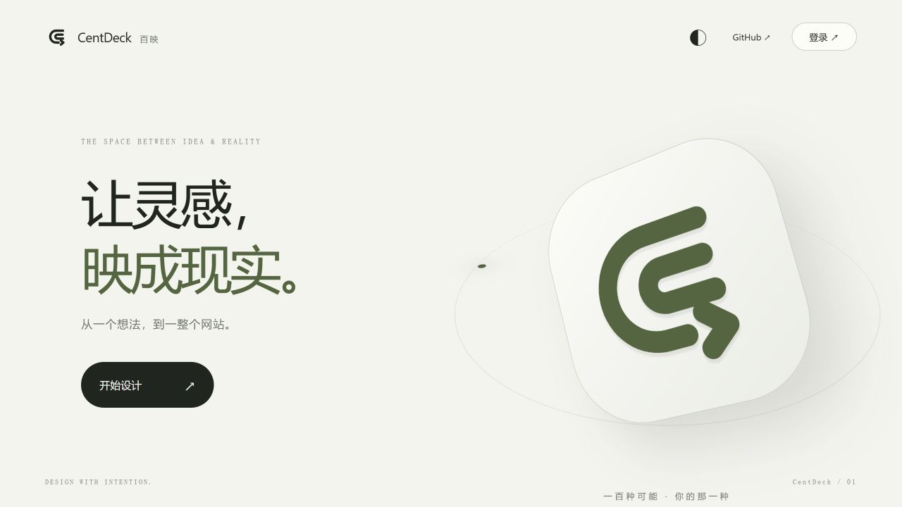
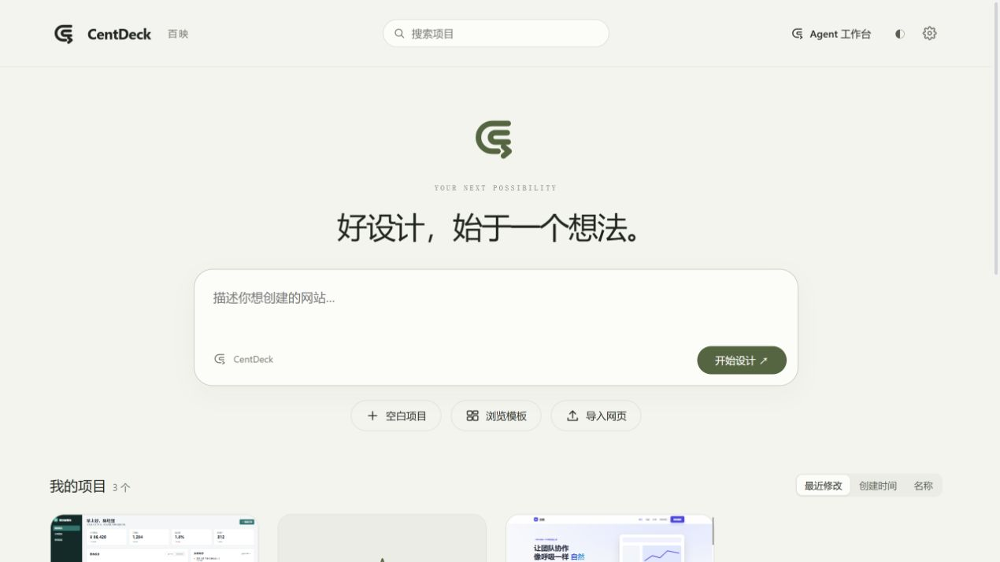
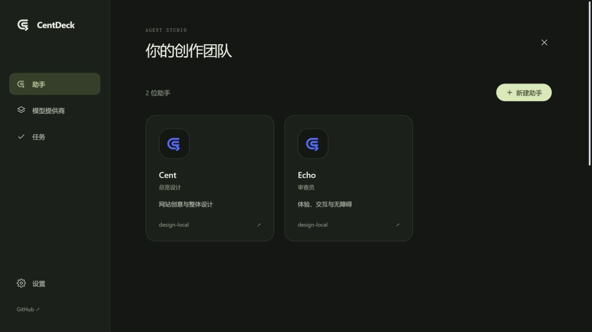
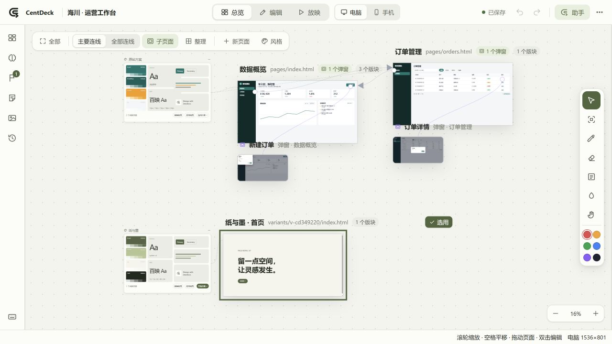
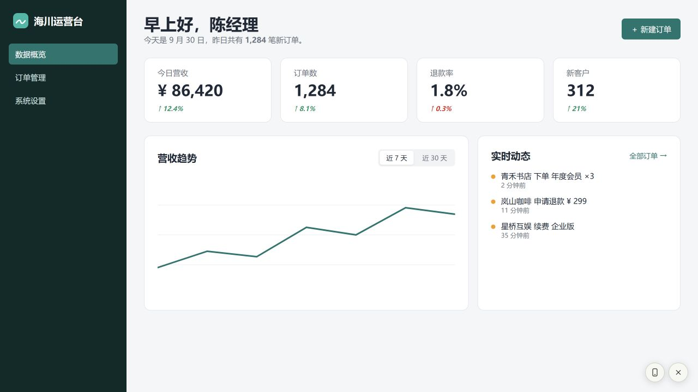

# CentDeck · Agent 工作台重构验收

日期：2026-09-30。版本：0.2.0。

本轮在已有 parse5 解析器、可视编辑和多助手窗口基础上，接续工作区未提交改动，完成品牌入口、Agent 工作台与任务运行链路，并修正总览和放映交互。

## 已完成

### 首页、账号与主题

- 原创 CentDeck SVG 标识，应用于网站图标、首页、工作台和默认助手头像。
- 首页使用纸白 / 墨绿视觉、留白与轻量动画；点击登录后首页滑开，露出登录表单。支持减少动态效果的系统偏好。
- 登录后的主界面包含网站需求输入、项目、模板和导入入口。
- 初始用户名、密码都是 `centdeck`。首次登录必须更改密码，用户名可保留。
- 账号单独存放于 `config.local/account.json`。按本地可编辑的需求保存用户名与密码；忘记时关闭服务、编辑文件、重启即可。登录会话不会写入仓库。
- 亮 / 暗主题可切换并保留选择。统一设置中提供 GitHub 链接、检查更新、重启和退出登录。

### Agent 工作台

- 助手、模型提供商、任务、设置集中在同一个页面。
- 内置通用、总览设计、视觉设计师、前端工程师、交互设计师、移动适配、审查员、品牌设计、无障碍检查角色，支持自行填写。
- 每个助手可以独立保存名字、上传头像、标识颜色、角色、职责、默认提示词、技能、模型与思考强度。
- 头像在浏览器中缩小为 256px WebP；窗口可停靠、浮动、缩放、折叠、隐藏和召回。
- 支持自定义 OpenAI 兼容 `/v1` 基础地址、密钥或本地免密钥接口；模型可以发现、搜索、手动填写、设为默认或按助手选择。
- 提供商支持工具调用、图片、思考参数能力开关。配置 API 返回脱敏密钥，完整值仅在本机服务端使用。
- 六个内置技能迁移到独立 `SKILL.md` 目录，保留设计方案、设计规范、页面修改、草图修改、导入整理，新增任务统筹。

### 实际任务链路

- 计划 / 创建模式与协作开关独立；模式限制在服务端工具和提交层执行。
- 支持独立执行、协作前确认、自动协作；主助手可直接完成任务，也可派发一层子任务。全局最多同时运行 3 个任务，一组最多 6 个子任务。
- 工具包括读取文件、项目上下文、提问、原子写文件、唯一文本补丁、新建风格方案和委派任务。
- 引用页面、元素、草图、文本文件和图片会传入模型请求；图片需显式启用提供商图片能力。
- 任务启动后固定模型，保留对话上下文、状态、事件、回答、用量与提交记录。SSE 实时更新执行状态。
- 停止或切回计划会使旧运行的迟到写入失效。重启后的未完成任务暂停，可手动继续。
- 每次写入验证页面范围、锁和读取版本；文本补丁只接受唯一匹配。用户手改之后，过期整页结果不能覆盖新内容。
- 多文件提交先整体校验，保留事务日志，失败回滚；可恢复中断的事务。
- 任务可以撤销最近提交。新方案撤销时移除生成的页面及关联规范卡；若页面后来被用户改过，会拒绝撤销，保留用户改动。
- 步数、时长和任务组 token 预算在服务端限制。未知用量采用保守估算；图片按视觉输入估算，不把 base64 字符当成普通文本计数。

### 总览、编辑与放映

- 大页面也可直接拖动，保留指针、手和空格平移的分工。
- 每套方案有独立的设计规范板，直接展示配色、字体、字号和组件，并连到对应页面；可选择整套方案或单独页面。
- 缩小时隐藏密集的连线说明与弹窗触发标记；放大后查看细节。
- 总览便签与编辑草图共用六色面板。删除、改色、文字保存和撤销流程统一；便签钉选中只增加轮廓，不改变形状。
- 桌面放映通过 `/show/<项目>/<页面>` 在当前浏览器直接打开原始网页，仅附加右下角手机切换、退出两个按钮。
- 手机放映使用 393px 内容视口，支持页面滚动与相对链接导航，不再模拟桌面浏览器或 Mac 窗口。
- 保留已有网页结构、文字属性、响应式检查、参考图与源码编辑能力。

## 配置与使用

| 内容 | 位置 |
| --- | --- |
| 账号 | `config.local/account.json` |
| 提供商 / 模型 | `config.local/settings.json` |
| 助手配置 | `config.local/assistants.json` |
| 项目对话与设计分组 | `projects/<项目>/project.json` |
| 任务 | `projects/<项目>/.centdeck/tasks.json` |
| 写入事务 / 历史 | `projects/<项目>/.centdeck/changes/`、`history/` |

使用 Node.js 22 或更新版本，执行 `node server/server.js`，或双击 `CentDeck.bat`。无需安装运行依赖。

完成首次登录后，进入 Agent 工作台的「模型提供商」，添加兼容接口并选择默认模型；在项目里给助手发送任务。计划模式用于讨论，创建模式用于写回。

检查更新只比较 GitHub 版本，不会自动覆盖本地文件。重启会断开登录并暂停未完成任务。

## 验证结果

本轮全部接口测试均使用独立临时配置、临时项目和本地模拟模型；没有读取、枚举或使用用户的真实 API 密钥，没有登录 Google。

| 检查 | 结果 |
| --- | --- |
| `node tests/api.test.mjs` | 13 项通过 |
| `node tests/engine.test.mjs` | 22 项通过 |
| `node tests/scan.test.mjs` | 9 项通过 |
| `node tests/token-source.test.mjs` | 5 组通过 |
| `node tests/workspace-state.test.mjs` | 撤销 / 重做、保存失败恢复、规范保存、响应式检测通过 |
| `node tests/agent-runtime.test.mjs` | 21 组通过 |
| `node --experimental-vm-modules tests/frontend-syntax.test.mjs` | 49 个浏览器模块语法通过 |

浏览器验收包括首页与登录动画、390px 窄屏、亮暗主题、统一设置、检查更新、头像上传、自定义角色与提示词、模拟接口模型发现、真实任务生成方案并刷新总览、大页面拖动并保留位置、方案选择、便签删除与改色保留文字、桌面放映和手机切换。

## 当前能力边界

- 真实付费提供商尚未进行在线调用验收；OpenAI 兼容协议链路使用本地模拟服务验证。不同厂商的模型名、工具能力和思考参数仍需按实际接口配置。
- 模型响应目前按完整响应接收，任务进度通过 SSE 更新；未实现逐 token 流式输出、自动备用模型切换和自动重试策略。
- 此版没有实现本机 MCP / ACP、外部助手进程接管、完整插件生态和自动浏览器视觉验收。
- 提交检查验证格式、范围、锁与版本；不等于语义、布局或全站样式依赖正确。设计规范应用主要更新规范变量，导入网页中写死的样式仍需调整。
- 手机预览模拟视口宽度，不模拟设备 UA、硬件、系统 API 或完整移动浏览器行为。
- 源码不存在的脚本运行时文字，不能直接通过静态源码改字；可交给助手修改实际生成逻辑。
- 用户项目目录与本地配置被 Git 忽略。本轮推送的是 CentDeck 工作台代码与公开验收文档，未实现用户生成网站的一键 GitHub 发布器。

<!-- CentDeck documentation. Licensing: LICENSE and THIRD_PARTY_NOTICES.md. -->
